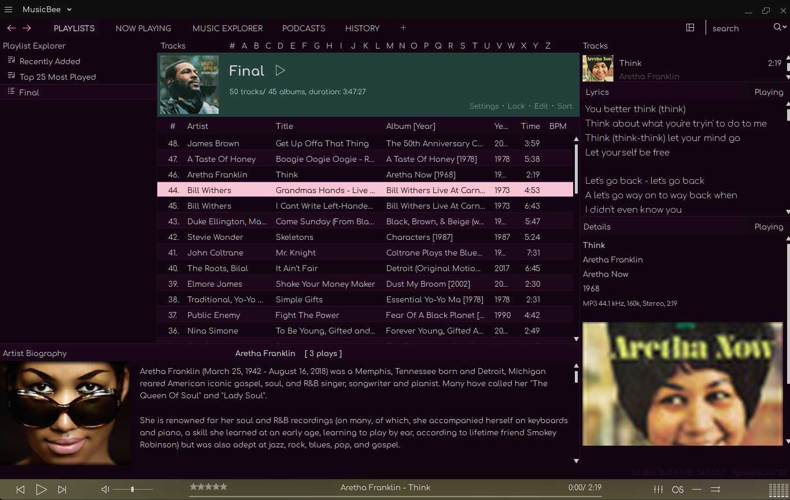
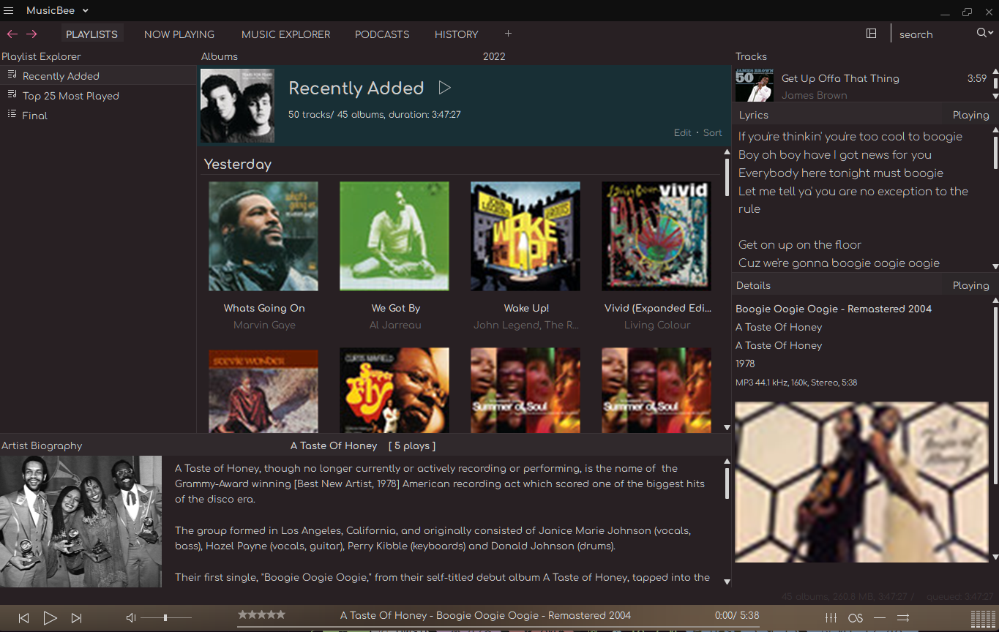
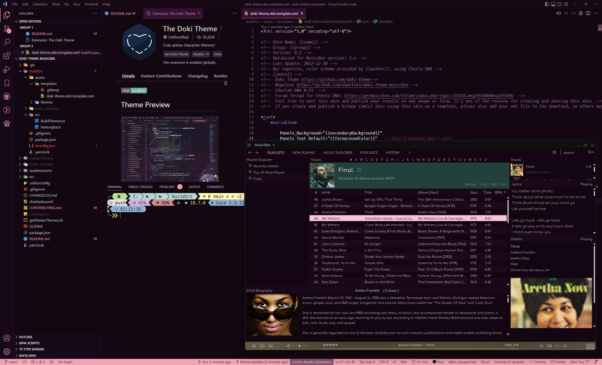

# The Doki Theme: MusicBee

Ever wanted your MusicBee to match your code editor style? Well you are in luck!

## Quick Theme Preview

### Gasai Yuno

## Aqua

## Astolfo

## Chocola

## With code editor

---

# Installation

> If you don't know how to install a skin in MusicBee, read this first
> 
> https://musicbee.fandom.com/wiki/Skins#Installing_a_custom_skin

Go to the [releases](https://github.com/nopeless/doki-theme-musicbee/releases) tab

Download the latest zip file

Extract and select your favorite anime character 

[Preview here](https://doki-theme.unthrottled.io/themes/)

# Known Limitations

Light themes do not work that well with this code (if there is enough interest, I'll fix this issue)

Sometimes the themes have too high contrast

## Contributions

Currently I do not accept contributions

